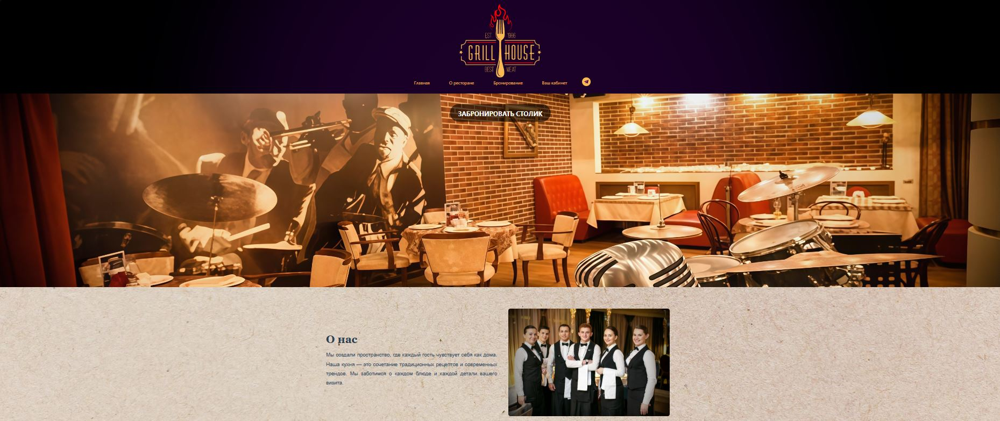
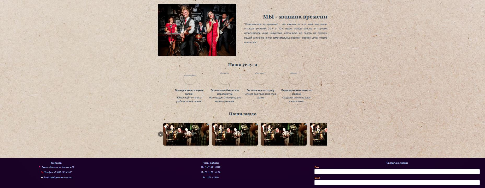
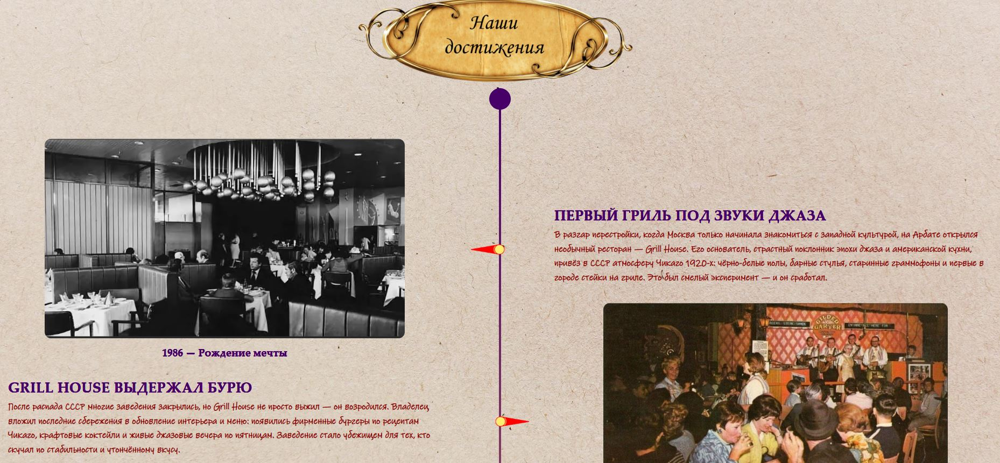
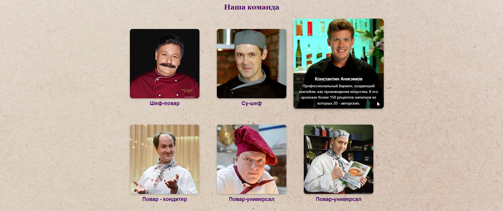
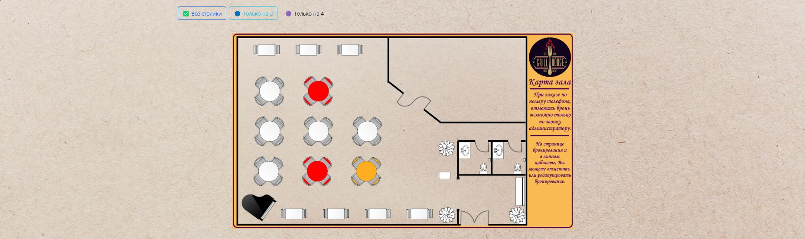
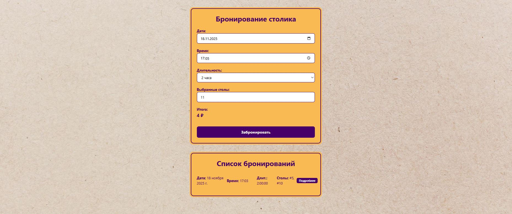
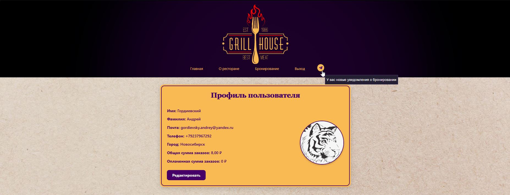
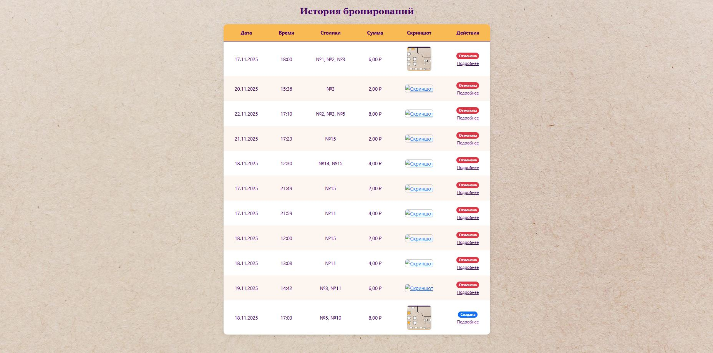
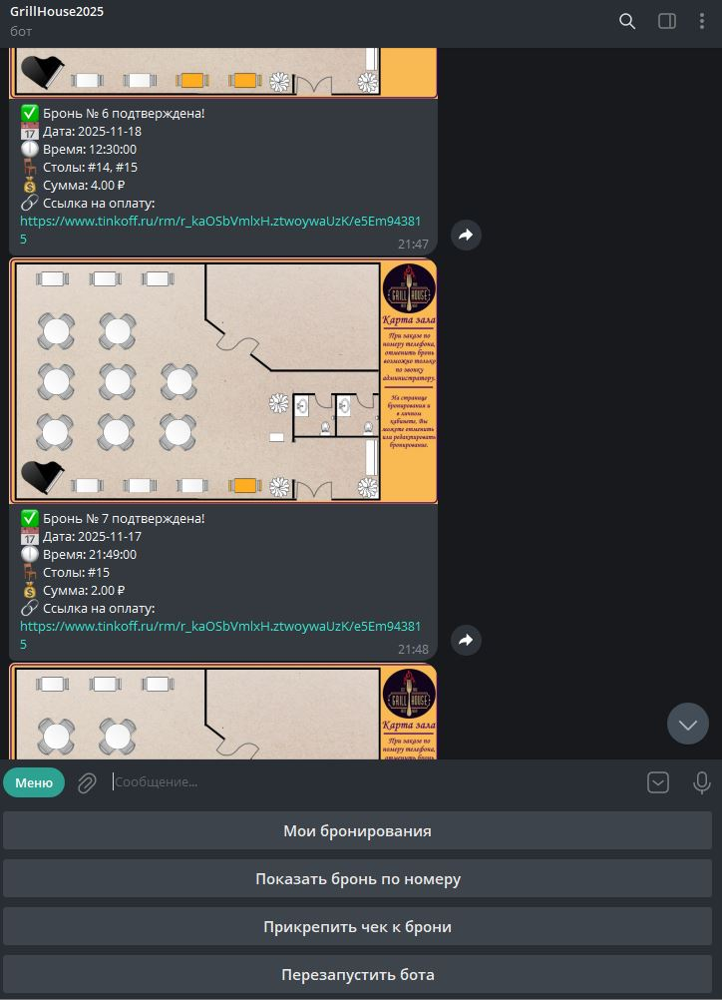

🍽️ RestOldPalace — Сайт для бронирования столиков в ресторане

🚀 Описание
RestOldPalace — это современный сайт для бронирования столиков в ресторане, созданный на Django + Bootstrap.
Позволяет клиентам:

- Просматривать план зала с визуальным выбором столов.
- Бронировать столики на 2 или 4 человека.
- Выбирать дату и время посещения.
- Получать подтверждение брони и ссылку на чек.

Администраторы могут:
- Управлять столиками и бронированиями через админку.
- Редактировать контент сайта.
- Отслеживать историю заказов.
- Отменять заказ.

📦 Функционал
✅ Главная страница
— Описание ресторана, услуги, контакты, форма обратной связи.



✅ Страница "О ресторане"
— История, миссия, команда.



✅ Страница бронирования
— Интерактивная карта зала с выбором столов на 2 или 4.
— Форма с датой, временем и ручным вводом номеров столов.
— Фильтрация по столам и занятым столикам
— Автоматический расчёт стоимости (2 рубля за стол на 2, 4 рубля за стол на 4).



✅ Личный кабинет
— Регистрация и авторизация.
— История бронирований.
— Управление текущими бронями (изменение, отмена).




✅ Админка
— Управление пользователями, столиками, бронированиями.
— Редактирование текстов и изображений.


✅ Telegram-бот
— Автоматическая отправка уведомлений о новых бронях с фото карты.
— Отправка чека брони и просмотр бронирований


✅ Оплата
— Работает оплата по системе СПБ.
Механизм работы:
1. Создается бронь(или редактируется) - отправляется сообщение по оплате QR код и ссылка в приложении
или ссылка в боте телеграм(если у пользователя есть телеграм_id). На оплату дается 15 минут.
2. Пользователь платит и сохраняет чек
3. Чек грузит боту по алгоритму "Прикрепить чек"
4. Админ после получения чека в админке проверяет и подтверждает или отменяет оплату

ЗАГРУЗКА ФИКСТУР СТОЛОВ:
необходимо в папке приложения создать папку *fixtures* и загрузить туда свою фикстуру и запустить команду:
```
python manage.py loaddata fixture_tables

```

### Описание модулей:
- *admin.py* - функционал для работы в админ панели с моделями и объектами приложения, управление контентом.
- *apps.py* - настройка правильных путей (именование приложения) и подключения доп функций.
- *context_processor.py* - позволяет задать действия из админки определенными сигналами для передачи в шаблон
и моделирований действий (к примеру оповещения)
- *forms.py* - формы для заполнения
- *mixins.py* - реализован механизм захвата скриншота карты зала
- *models.py* - модели приложения
- *signals.py* - отслеживаем изменения в админке по заказам и уведомляем в боте
- *tasks.py* - задачи на отслеживнии времени оплаты и автозавершения брони
- *urls.py* - пути контроллеров
- *views.py* - контроллеры веб приложения
- *telegram_bot.py* -тело бота телеграмм
- *hall_map.py* - тестовая - локальная версия карты сайта (демка)

📜 Лицензия
MIT License — свободное использование, модификация, распространение.
